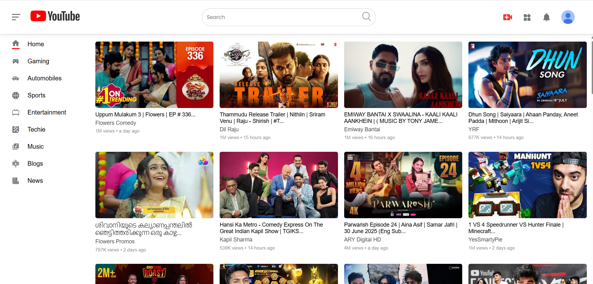
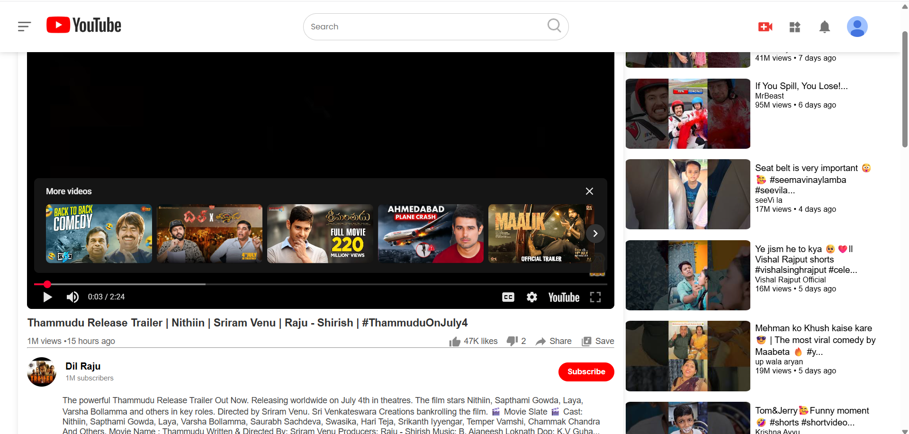
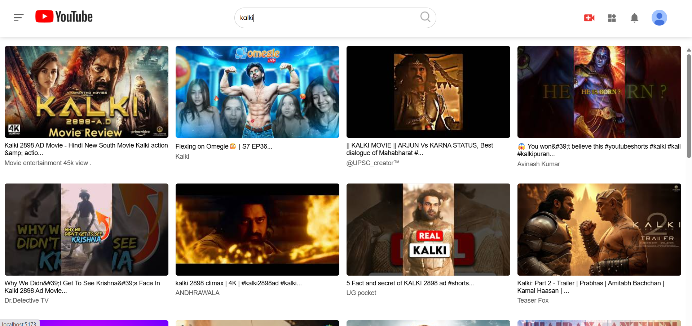

# 🎬 YouTube Clone – React Frontend Project

This is a **data-driven YouTube clone frontend** built using **React JS** and the **YouTube Data API**. It replicates core YouTube functionality including home feed, video pages, search, and recommended videos — all integrated dynamically via API. The app is built with a clean component architecture and route-based navigation.

---

## 🚀 Features

- 📺 Home feed with real video data from YouTube API
- 🔍 Search functionality with dynamic results
- 🎞️ Recommended video section (related content)
- 🧭 Dynamic routing for individual video pages
- 🧩 Modular, reusable components
- 🎨 Sidebar toggle using `useState`
- 🌐 Responsive and styled with scoped CSS

---

## 🧱 Tech Stack

- **React JS**
- **React Router DOM**
- **YouTube Data API v3**
- **JavaScript (ES6+)**
- **CSS**

---

## 📁 Folder Structure

```
src/
├── assets/                      # Static icons and thumbnails
├── components/
│   ├── Navbar.jsx
│   ├── Sidebar.jsx
│   ├── feed/Feed.jsx
│   ├── recommend/Recommend.jsx
│   └── searchfeed/Searchfeed.jsx
├── pages/
│   ├── home/                    # Homepage with fetched feed
│   ├── search/                  # Search results from API
│   └── video/                   # Video detail view
├── App.jsx                      # Main component with routes
├── main.jsx                     # React entry point
└── index.css                    # Global styles
```

---

## 🔌 YouTube API Integration

The app uses **YouTube Data API v3** to fetch:

- Most popular videos for the feed
- Search results by keyword
- Video details for watch pages
- Related videos for recommendations

Your API key is managed securely in the project (e.g., via `.env` file).

---

## 📦 Getting Started

```bash
git clone <your-repo-link>
cd your-project-folder
npm install
npm run dev
```

Make sure to set up your `.env` file with your API key:

```env
VITE_YOUTUBE_API_KEY=your_api_key_here
```

---

## 🧠 Project Highlights

- Clean separation of logic and UI
- Dynamic routing with React Router
- YouTube API calls using `fetch` or `axios`
- Scalable component structure
- Sidebar layout and responsive design

---

## 📸 Screenshots

### 🔹 Home Page


### 🔹 Video Page


### 🔹 Search Results


---

## 🔮 Future Improvements

- Add login/signup (OAuth or custom auth)
- Improve mobile responsiveness
- Dark mode support
- Video player enhancements

---

## 🤝 Contact

If you'd like to give feedback, collaborate, or ask questions — feel free to connect!